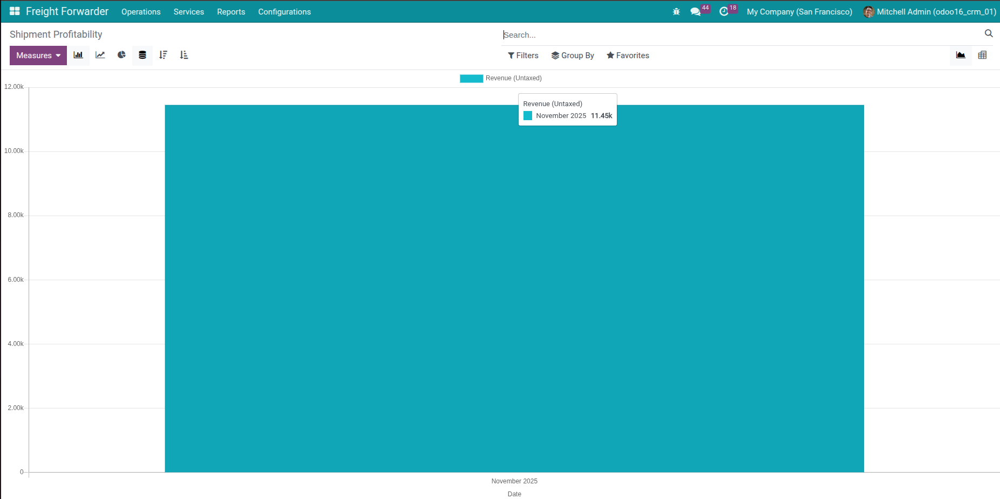

Installation
============

1. Navigate to **Apps**.
2. Search for *viin_freight_management*.
3. Click **Install**.

The module automatically initializes reference data such as template routes, HS codes, UN numbers, dangerous goods classifications, units of measure, and automation templates so you can start using it right away.

Integrated modules in Freight Forwarder
=======================================
1. Project
2. Sale & Purchase
3. Document
4. Account

`Learn more <https://viindoo.com/documentation/16.0/applications/supply-chain/forwarder/integration.html>`_

Initial setup
=============

- `Getting started with Freight Forwarder <https://viindoo.com/documentation/16.0/applications/supply-chain/forwarder/getting-started.html>`_
- `Freight extension list <https://viindoo.com/documentation/16.0/applications/supply-chain/forwarder/master-data.html>`_

Freight Forwarder workflow overview
===================================

- `Freight Forwarder end-to-end process <https://viindoo.com/documentation/16.0/applications/supply-chain/forwarder/overview.html>`_
- `Freight Forwarder booking management <https://viindoo.com/documentation/16.0/applications/supply-chain/forwarder/booking.html>`_

.. image:: img/shipment.jpg
   :alt: Freight user permission interface
   :align: center
   :width: 1100

.. image:: img/tracking.jpg
   :alt: Freight user permission interface
   :align: center
   :width: 1100

Analysis & reporting
====================

- `Freight Forwarder analysis & reporting <https://viindoo.com/documentation/16.0/applications/supply-chain/forwarder/analysis-and-reporting.html>`_

Supported editions
==================
1. Community Edition
2. Enterprise Edition
