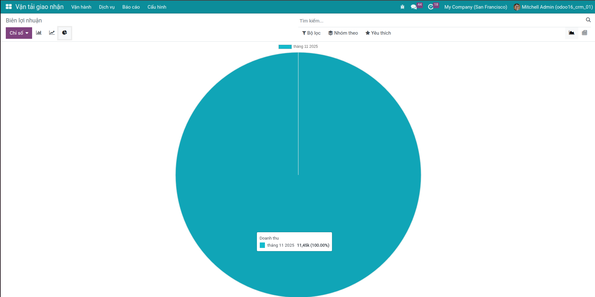

Cài đặt
=======

1. Truy cập **Ứng dụng**.
2. Tìm từ khóa *viin_freight_management*.
3. Bấm **Cài đặt**.

Mô đun sẽ tự động khởi tạo dữ liệu tham chiếu gồm tuyến mẫu, mã HS, mã UN, phân loại hàng nguy hiểm, đơn vị đo lường và mẫu hoạt động tự động để bạn bắt đầu sử dụng ngay.

Các module tích hợp trong Freight Forwarder
===========================================
1. Project
2. Sale & Purchase
3. Document
4. Account

`Xem Thêm <https://viindoo.com/documentation/16.0/vi/applications/supply-chain/forwarder/integration.html>`_

Thiết lập ban đầu
=================

- `Hướng dẫn khởi động với Freight Forwarder <https://viindoo.com/documentation/16.0/vi/applications/supply-chain/forwarder/getting-started.html>`_
- `Danh sách tiện ích mở rộng Freight <https://viindoo.com/documentation/16.0/vi/applications/supply-chain/forwarder/master-data.html>`_

Tổng quan nghiệp vụ Freight Forwarder
=====================================

- `Quy trình tổng quan Freight Forwarder <https://viindoo.com/documentation/16.0/vi/applications/supply-chain/forwarder/overview.html>`_
- `Quản lý booking Freight Forwarder <https://viindoo.com/documentation/16.0/vi/applications/supply-chain/forwarder/booking.html>`_

.. image:: img/shipment.vi.jpg
   :alt: Giao diện phân quyền người dùng Freight
   :align: center
   :width: 1100

.. image:: img/tracking.vi.jpg
   :alt: Giao diện phân quyền người dùng Freight
   :align: center
   :width: 1100

Phân tích & báo cáo
===================

- `Phân tích & báo cáo Freight Forwarder <https://viindoo.com/documentation/16.0/vi/applications/supply-chain/forwarder/analysis-and-reporting.html>`_

Ấn bản được hỗ trợ
==================
1. Ấn bản cộng đồng
2. Ấn bản doanh nghiệp
